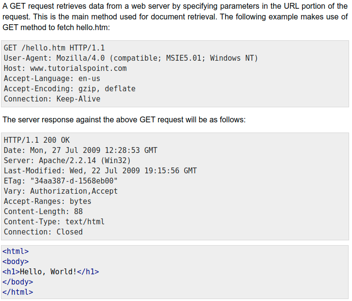
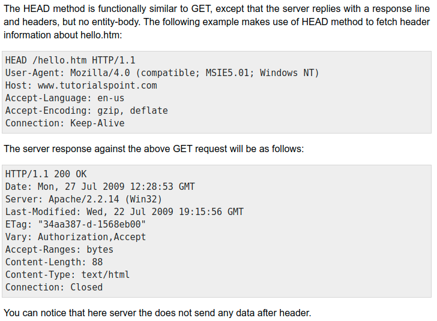
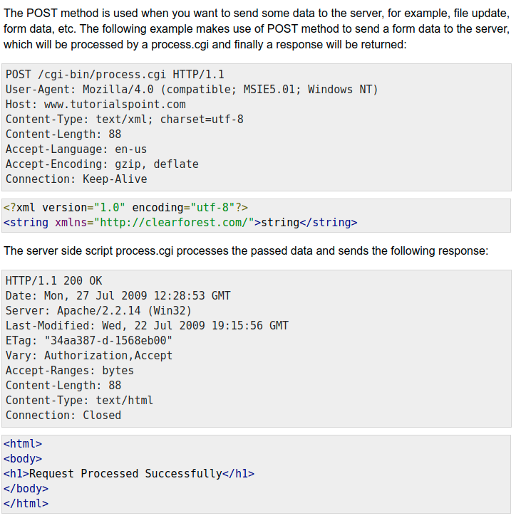
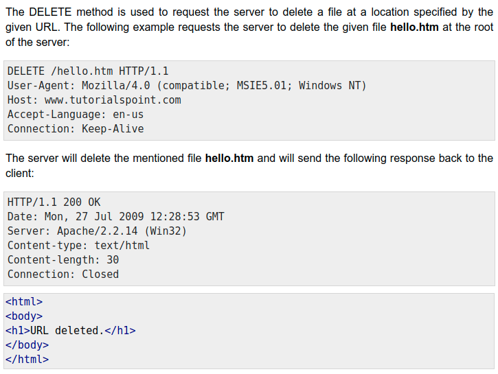
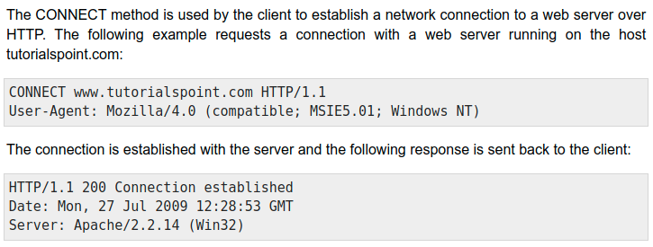
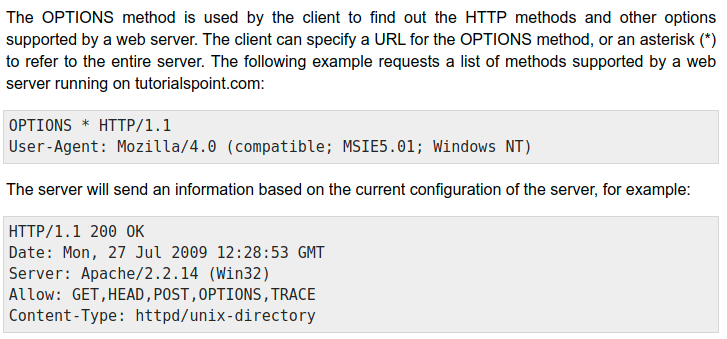
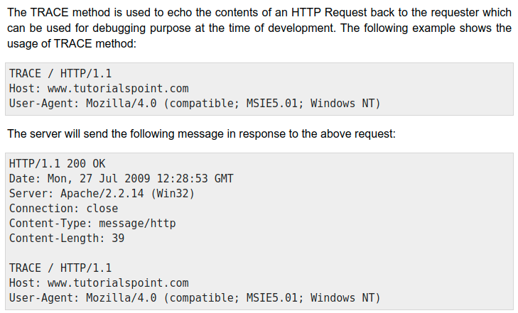
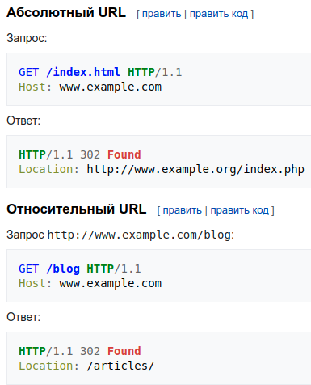

# Формат HTTP-запросов и ответов

<pre>
начальная строка *( заголовок CRLF ) CRLF [ тело сообщения ]
* Может быть 0 и больше заголовков
* Тело сообщения может быть пустым
* Начальная строка либо строка запроса либо строка состояния(ответа)
* CRLF - \r\n
* При ошибке в грамматике - ошибка 400
</pre>

## Строка запроса

<pre>
метод SP цель запроса SP Версия-HTTP CRLF
* SP - пробел
* Длина строки запроса может быть 8000 символов(ограничение)
* Если > ограничения - 501(не реализовано), таймаут по времени - 414(слишком длинный)
</pre>

## Строка состояния

<pre>
Версия-HTTP SP код статуса SP фраза-причина CRLF
* Код статуса - 3-значная цифра
* Фраза-причина -> *( HTAB / SP / VCHAR / obs-text) - игнорируется клиентом
</pre>

## Заголовки

<pre>
поле : OWS значение OWS
* Поля нечувствительны к регистру
* Значений м\б несколько, они разделяются запятой
</pre>

## Пробелы

<pre>
OWS - optional whitespace
RWS - required whitespace
BWS - «bad» whitespace
* По-хорошему OWS, RWS - обозначают один SP
* По-плохому OWS = *( SP / HTAB ), RWS = 1*( SP / HTAB )
</pre>

## Заголовок Transfer-Encoding

<pre>
Представление: 
< длина блока в HEX >< CRLF >< содержание блока >< CRLF >
* Последний блок 0< CRLF >< CRLF >
* Используется для передачи данных, когда заранее не известен размер блока
</pre>

### Типы
<pre>
chunked
compress
deflate
gzip
</pre>

### Пример

### Замечания
<pre>
Не отправляем данный заголовок с кодами 1хх или 204; 2хх при CONNECT
Запросы с кодировкой, которая не реализована выдает 501(не реализовано)
</pre>

## Заголовок Content-Length

<pre>
Ожидаемый размер блока сообщения
* Если есть Transfer-Encoding, то Content-Length не может быть.
* Если Content-Length имеет недопустимое значение или их несколько, то
это ошибка. Если запрос, то ошибка 400 (неверный запрос) и закрытие
соединения. Если ответное сообщение, полученное прокси-сервером, 
последний должензакрыть соединение с сервером,отбросить полученный 
ответ и отправить клиенту ответ 502 (Bad Gateway).
</pre>

## Запрос цели

<pre>
4 формата для запроса цели:

request-target = origin-form
/ absolute-form
/ authority-form
/ asterisk-form

<h3>origin-form = absolute-path [ "?" query ]</h3>
Например, клиент, желающий получить представление ресурса, 
идентифицированного как http://www.example.org/where?q=now
непосредственно с исходного сервера откроет (или повторно использует) 
TCP-соединение с портом 80 хоста «www.example.org» и отправит строки:

GET /where?q=now HTTP/1.1
Host: www.example.org

<h3>absolute-form = absolute-URI</h3>
Пример абсолютной формы строки запроса:
GET http://www.example.org/pub/WWW/TheProject.html HTTP/1.1

<h3>authority-form = authority</h3>
* Только для запросов CONNECT
CONNECT www.example.com:80 HTTP/1.1

<h3>sterisk-form = "*"</h3>
* Только для запросов OPTIONS
</pre>

## Заголовок Host

<pre>
Host = uri-host [ ":" port ] 
* Используется для того, чтобы сервер мог различать ресурсы при
обслуживании запросов для нескольких имен хостов на одном IP-адресе
* Сервер ДОЛЖЕН ответить кодом состояния 400 (неверный запрос) на 
любое сообщение запроса HTTP/1.1, в котором отсутствует поле заголовка
Host, и на любое сообщение запроса, содержащее более одного поля 
заголовка Host, или поле заголовка Host с недопустимым значением поля.
</pre>

## Заголовок Connection

<pre>
Connection = 1#connection-option
connection-option = token

* Параметр «close» (закрыть) для соединения определен для отправителя, 
чтобы сигнализировать, что это соединение будет закрыто после 
завершения ответа. Например,
Connection: close
</pre>

## Соединение по умолчанию

<pre>
HTTP/1.1 по умолчанию использует «persistent connections» 
(постоянные соединения),что позволяет передавать несколько запросов
и ответов по одному соединению.

Алгоритм:
* При наличии опции «close» соединение не будет сохраняться 
после текущего ответа; иначе,
* Если получен протокол HTTP/1.1 (или более поздний), соединение
будет сохраняться после текущего ответа; иначе,
* Если получен протокол HTTP/1.0, присутствует опция соединения 
keep-alive, получатель не является прокси-сервером, а получатель
желает соблюдать механизм HTTP-1.0 keep-alive, соединение будет 
сохраняться после текущий ответ; иначе,
* Соединение закроется после текущего ответа.

Клиент МОЖЕТ отправлять дополнительные запросы на постоянное
соединение до тех пор, пока он не отправит или не получит опцию 
«close», или не получит ответ HTTP/1.0 без опции соединения «keep-alive».
</pre>

## Сбои и таймауты

<pre>
* Обычно у серверов будет некоторое время ожидания, после которого 
они больше не будут поддерживать неактивное соединение. 
* Использование постоянных соединений не предъявляет никаких требований к 
длине (или существованию) этого тайм-аута ни для клиента, ни для сервера.
* Реализации ДОЛЖНЫ постоянно отслеживать открытые соединения на предмет
принятого сигнала закрытия и реагировать на него соответствующим образом,
поскольку быстрое закрытие обеих сторон соединения позволяет 
восстанавливать выделенные системные ресурсы.
</pre>

## Срывание

<pre>
Сервер, который получает опцию «close», ДОЛЖЕН инициировать закрытие 
соединения после отправки окончательного ответа на запрос, содержащий 
«close». Сервер ДОЛЖЕН отправить опцию «close» в своем окончательном 
ответе на это соединение. Сервер НЕ ДОЛЖЕН обрабатывать любые 
дальнейшие запросы, полученные по этому соединению.
Если сервер выполняет немедленное закрытие TCP-соединения, существует
значительный риск того, что клиент не сможет прочитать последний HTTP-ответ.
</pre>

## Метаданные представления

<pre>
<h3>Content-Type = media-type</h3>
media-type = type "/" subtype *( OWS ";" OWS parameter )
type = token
subtype = token
parameter = token "=" ( token / quoted-string )

	Значение параметра, соответствующее производству токена, может быть 
передано либо в виде токена, либо внутри строки в кавычках. Значения в 
кавычках и без кавычек эквивалентны. 
	Например, все следующие примеры эквивалентны, но первый 
предпочтителен для согласованности:

text/html;charset=utf-8
text/html;charset=UTF-8
Text/HTML;Charset="utf-8"
text/html; charset="utf-8"

	Отправителю, который генерирует сообщение, содержащее тело полезной
нагрузки, СЛЕДУЕТ генерировать поле заголовка Content-Type в этом 
сообщении, если только предполагаемый тип мультимедиа вложенного 
представления неизвестен отправителю. Если поле заголовка Content-Type 
отсутствует, получатель МОЖЕТ либо принять тип носителя 
«application/octet-stream» либо проверить данные, чтобы определить его тип.

<h3>Content-Encoding = 1#content-coding</h3>
Примером его использования является:
Content-Encoding: gzip

	Исходный сервер МОЖЕТ ответить кодом состояния 415 (неподдерживаемый тип
носителя), если представление в сообщении запроса имеет неприемлемую к
одировку контента.

<h3>Content-Language = 1#language-tag</h3>
	Основная цель Content-Language — позволить пользователю идентифицировать
и дифференцировать представления в соответствии с предпочтительным 
языком пользователя.

	Несколько языков МОГУТ быть перечислены для контента, который
предназначен для нескольких аудиторий. 
	Например, исполнение «Договора Вайтанги», представленное одновременно 
в оригинальной и маорийской версиях, потребовало бы:
Content-Language: mi, en

	Content-Language МОЖЕТ применяться к любому типу медиа — он не 
ограничивается текстовыми документами.

	Если Content-Language не указан, по умолчанию используется контент, 
предназначенный для всех языковых аудиторий. Это может означать, 
что отправитель не считает его специфичным для какого-либо естественного 
языка или что отправитель не знает, для какого языка он предназначен.

<h3>Content-Location = absolute-URI / partial-URI</h3>
// Требует уточнения
</pre>

## Методы запроса

<pre>
* Чувствительны к регистру

1. GET
ПЕРЕДАТЬ ТЕКУЩЕЕ ПРЕДСТАВЛЕНИЕ ЦЕЛЕВОГО РЕСУРСА

2. HEAD
ТО ЖЕ, ЧТО И GET, НО ТОЛЬКО ПЕРЕНОС СТРОКИ СОСТОЯНИЯ И РАЗДЕЛА ЗАГОЛОВКА

3. POST
ВЫПОЛНИТЕ СПЕЦИФИЧНУЮ ДЛЯ РЕСУРСА ОБРАБОТКУ ПОЛЕЗНОЙ НАГРУЗКИ ЗАПРОСА

4. PUT
ЗАМЕНИТЕ ВСЕ ТЕКУЩИЕ ПРЕДСТАВЛЕНИЯ ЦЕЛЕВОГО РЕСУРСА ПОЛЕЗНОЙ НАГРУЗКОЙ
ЗАПРОСА

5. DELETE
УДАЛИТЬ ВСЕ ТЕКУЩИЕ ПРЕДСТАВЛЕНИЯ ЦЕЛЕВОГО РЕСУРСА

6. CONNECT
УСТАНОВИТЕ ТУННЕЛЬ К СЕРВЕРУ, УКАЗАННОМУ ЦЕЛЕВЫМ РЕСУРСОМ

7. OPTIONS
ОПИШИТЕ ПАРАМЕТРЫ СВЯЗИ ДЛЯ ЦЕЛЕВОГО РЕСУРСА

8. TRACE
ВЫПОЛНИТЕ ПРОВЕРКУ ОБРАТНОЙ СВЯЗИ ПО ПУТИ К ЦЕЛЕВОМУ РЕСУРСУ

* Все серверы общего назначения ДОЛЖНЫ поддерживать методы GET и HEAD. 
Все остальные методы НЕОБЯЗАТЕЛЬНЫ.
* Когда получен метод запроса, который не распознан или не реализован 
сервером происхождения, сервер происхождения ДОЛЖЕН ответить кодом 
состояния 501 (Не реализовано). Когда получен метод запроса, который 
известен исходному серверу, но не разрешен для целевого ресурса, 
исходный сервер ДОЛЖЕН ответить кодом состояния 405 (метод не разрешен).
</pre>

## Метод GET

<pre>
	Метод GET запрашивает передачу текущего выбранного представления 
для целевого ресурса.
	Соблазнительно думать об идентификаторах ресурсов как об именах 
путей удаленной файловой системы, а об представлениях — как о копии
содержимого таких файлов.
	Полезная нагрузка в сообщении запроса GET не имеет определенной
семантики; отправка тела полезной нагрузки по запросу GET может 
привести к тому, что некоторые существующие реализации отклонят запрос.
</pre>

### Пример

## Метод HEAD

<pre>
	Метод HEAD идентичен GET, за исключением того, что сервер НЕ 
ДОЛЖЕН отправлять тело сообщения в ответе (то есть ответ 
заканчивается в конце раздела заголовка).
	Этот метод может использоваться для получения метаданных о 
выбранном представлении без передачи данных представления и часто 
используется для проверки гипертекстовых ссылок на достоверность, 
доступность и недавнюю модификацию.
	Полезная нагрузка в сообщении запроса HEAD не имеет определенной
семантики; отправка тела полезной нагрузки по запросу HEAD может 
привести к тому, что некоторые существующие реализации отклонят запрос.
</pre>

### Пример

## Метод POST

<pre>
POST используется для следующих функций:
* Предоставление блока данных, такого как поля, введенные в форму HTML,
для процесса обработки данных;
* Размещение сообщения на доске объявлений, в группе новостей, списке
рассылки, блоге или подобной группе статей;
* Создание нового ресурса, который еще не идентифицирован исходным 
сервером;
* Добавление данных к существующему представлению (ям) ресурса.
</pre>

### Пример

## Метод PUT

<pre>
	Метод PUT запрашивает, чтобы состояние целевого ресурса было
создано или заменено на состояние, определенное представлением, 
заключенным в полезную нагрузку сообщения запроса. Успешное PUT данного
представления предполагает, что последующее GET для того же целевого
ресурса приведет к отправке эквивалентного представления в ответе 200 (ОК). 
* Если ресурса нет, а PUT создает, то 201 (создано), иначе 200 (ОК) или
204 (без содержимого).
</pre>

## Метод DELETE

<pre>
	Метод DELETE запрашивает, чтобы исходный сервер удалил связь между 
целевым ресурсом и его текущей функциональностью. По сути, этот метод 
аналогичен команде rm в UNIX: он выражает операцию удаления в 
сопоставлении URI исходного сервера, а не ожидание удаления ранее 
связанной информации.
</pre>

### Пример

## Метод CONNECT

<pre>
	CONNECT предназначен только для использования в запросах к прокси. 
Исходный сервер, который получает запрос CONNECT для себя, МОЖЕТ 
ответить кодом статуса 2xx (Успешно), чтобы указать, что соединение
установлено. Однако большинство исходных серверов не поддерживают CONNECT.
</pre>

### Пример

## Метод OPTIONS

<pre>
	Метод OPTIONS запрашивает информацию о параметрах связи, доступных
для целевого ресурса, либо на исходном сервере, либо на промежуточном
посреднике.
	Запрос OPTIONS со звездочкой («*») в качестве цели запроса 
применяется к серверу в целом, а не к конкретному ресурсу.
</pre>

### Пример

## Метод TRACE

<pre>
	Метод TRACE запрашивает удаленную обратную петлю сообщения запроса
на уровне приложения. 
</pre>

### Пример

## Заголовок Accept-Charset

<pre>
Accept-Charset = 1#( ( charset / "*" ) [ weight ] )
* Пользовательский агент может отправить поле заголовка «Accept-Charset»,
чтобы указать, какие кодировки допустимы в текстовом ответном контенте.
* Запрос без какого-либо поля заголовка Accept-Charset подразумевает, 
что пользовательский агент примет любую кодировку в ответ.
* Если в заголовке присутствует поле заголовка Accept-Charset и ни одно
из доступных представлений для ответа не содержит кодировку, которая 
указана как приемлемая, сервер-источник может либо обработать поле 
заголовка, отправив ответ 406 (не приемлемо), или не обращайте внимания
на поле заголовка, рассматривая ресурс так, как будто он не подлежит 
согласованию содержимого.
</pre>

## Заголовок Accept-Language

<pre>
Accept-Language = 1#( language-range [ weight ] )
language-range = <language-range>

Поле заголовка «Accept-Language» может использоваться пользовательскими
агентами для указания набора естественных языков, которые являются 
предпочтительными в ответе.

Пример:
Accept-Language: da, en-gb;q=0.8, en;q=0.7
будет означать: «Я предпочитаю датский, но приму британский английский
и другие типы английского».

* Запрос без какого-либо поля заголовка Accept-Language подразумевает, 
что пользовательский агент примет любой язык в ответ. Если поле заголовка 
присутствует в запросе и ни одно из доступных представлений для ответа не 
имеет соответствующего языкового тега, сервер происхождения может либо 
игнорировать поле заголовка, обрабатывая ответ, как если бы он не подлежал 
согласованию содержимого, либо соблюдать заголовок поле, отправив ответ 
406 (не приемлемо).
</pre>

## Заголовок User-Agent

<pre>
User-Agent = product *( RWS ( product / comment ) )
product = token ["/" product-version]
product-version = token

	Поле заголовка «Пользователь-агент» содержит информацию о 
пользовательском агенте, инициирующем запрос.

Пример:
User-Agent: CERN-LineMode/2.15 libwww/2.17b3
</pre>

## Коды состояния ответа

<pre>
	Элемент кода состояния представляет собой трехзначный код,
дающий результат попытки понять и удовлетворить запрос.

Первая цифра кода состояния определяет класс ответа, их 5:

1xx (информационный): запрос получен, процесс продолжается
2xx (успешно): запрос был успешно получен, понят и принят
3xx (перенаправление): для выполнения запроса необходимо предпринять дальнейшие действия
4xx (ошибка клиента): запрос содержит неверный синтаксис или не может быть выполнен
5xx (ошибка сервера): серверу не удалось выполнить явно допустимый запрос

</pre>

## Заголовок Date

<pre>
Date = HTTP-date
HTTP-date = IMF-fixdate / obs-date
IMF-fixdate = day-name "," SP date1 SP time-of-day SP GMT
	day-name = { "Mon", "Tue", "Wed", "Thu", "Fri", "Sat", "Sun"}
	date1 = day SP month SP year
		day = 2DIGIT
		month = { "Jan", "Feb", "Mar", "Apr", "May", "Jun", "Jul",
					"Aug", "Sep", "Oct", "Nov", "Dec"}
		year = 4DIGIT
	time-of-day = hour ":" minute ":" second
		hour = 2DIGIT
		minute = 2DIGIT
		second = 2DIGIT
Поле заголовка «Дата» представляет дату и время, когда сообщение было отправлено.
Примером является:
Date: Tue, 15 Nov 1994 08:12:31 GMT
</pre>

## Заголовок Location

<pre>
Location = URI-reference

Поле заголовка «Location» используется в некоторых ответах для ссылки 
на конкретный ресурс по отношению к ответу. Тип отношения определяется 
комбинацией метода запроса и семантики кода состояния.

Используется для:
1. Чтобы попросить браузер загрузить другую web-страницу (Перенаправление 
URL). В этом случае заголовок Location должен быть отправлен вместе с 
кодом состояния 3xx.
2. Для предоставления информации о новом местоположении ресурса. 
Код состояния должен быть 201 или 202.
</pre>

### Пример

## Заголовок Retry-After

<pre>
Retry-After = HTTP-date / delay-seconds
delay-seconds = 1*DIGIT

	Серверы отправляют поле заголовка «Retry-After», чтобы указать, 
как долго пользовательский агент должен ждать перед выполнением 
последующего запроса.

Два примера его использования:
1. Retry-After: Fri, 31 Dec 1999 23:59:59 GMT
2. Retry-After: 120
</pre>

## Заголовок Allow

<pre>
Allow = #method

	Поле заголовка «Allow» содержит список методов, объявленных как
поддерживаемые целевым ресурсом. Цель этого поля — строго 
информировать получателя о допустимых методах запроса, связанных 
с ресурсом.

Пример использования:
Allow: GET, HEAD, PUT

! Посылается сервером со статусами 405 и 501; и в ответе на метод OPTIONS.
</pre>

## Заголовок Server

<pre>
Server = product *( RWS ( product / comment ) )

	Поле заголовка «Сервер» содержит информацию о ПО, используемом 
исходным сервером для обработки запроса.

Примеры:
1. Server: CERN/3.0 libwww/2.17
2. Server: Apache/2.4.1 (Unix)
</pre>

## Заголовок Last-Modified

<pre>
Last-Modified = HTTP-date

Поле заголовка «Last-Modified» в ответе содержит временную метку, 
указывающую дату и время, когда сервер-источник считает, что 
выбранное представление было последний раз изменено, как было 
определено в конце обработки запроса.

Пример:
Last-Modified: Tue, 15 Nov 1994 12:45:26 GMT

! Нужно использовать stat.st_mtime, чтобы получить время последней
модификации.
</pre>