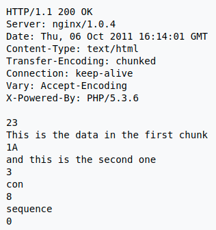

# Формат HTTP-запросов и ответов

<pre>
начальная строка *( заголовок CRLF ) CRLF [ тело сообщения ]
* Может быть 0 и больше заголовков
* Тело сообщения может быть пустым
* Начальная строка либо строка запроса либо строка состояния(ответа)
* CRLF - \r\n
* При ошибке в грамматике - ошибка 400
</pre>

## Строка запроса

<pre>
метод SP цель запроса SP Версия-HTTP CRLF
* SP - пробел
* Длина строки запроса может быть 8000 символов(ограничение)
* Если > ограничения - 501(не реализовано), таймаут по времени - 414(слишком длинный)
</pre>

## Строка состояния

<pre>
Версия-HTTP SP код статуса SP фраза-причина CRLF
* Код статуса - 3-значная цифра
* Фраза-причина -> *( HTAB / SP / VCHAR / obs-text) - игнорируется клиентом
</pre>

## Заголовки

<pre>
поле : OWS значение OWS
* Поля нечувствительны к регистру
* Значений м\б несколько, они разделяются запятой
</pre>

## Пробелы

<pre>
OWS - optional whitespace
RWS - required whitespace
BWS - «bad» whitespace
* По-хорошему OWS, RWS - обозначают один SP
* По-плохому OWS = *( SP / HTAB ), RWS = 1*( SP / HTAB )
</pre>

## Заголовок Transfer-Encoding

<pre>
Представление: 
< длина блока в HEX >< CRLF >< содержание блока >< CRLF >
* Последний блок 0< CRLF >< CRLF >
* Используется для передачи данных, когда заранее не известен размер блока
</pre>

### Типы
<pre>
chunked
compress
deflate
gzip
</pre>

### Пример

### Замечания
<pre>
Не отправляем данный заголовок с кодами 1хх или 204; 2хх при CONNECT
Запросы с кодировкой, которая не реализована выдает 501(не реализовано)
</pre>

## Заголовок Content-Length

<pre>
Ожидаемый размер блока сообщения
* Если есть Transfer-Encoding, то Content-Length не может быть
</pre>
